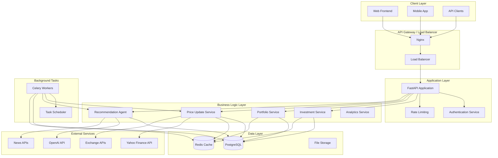
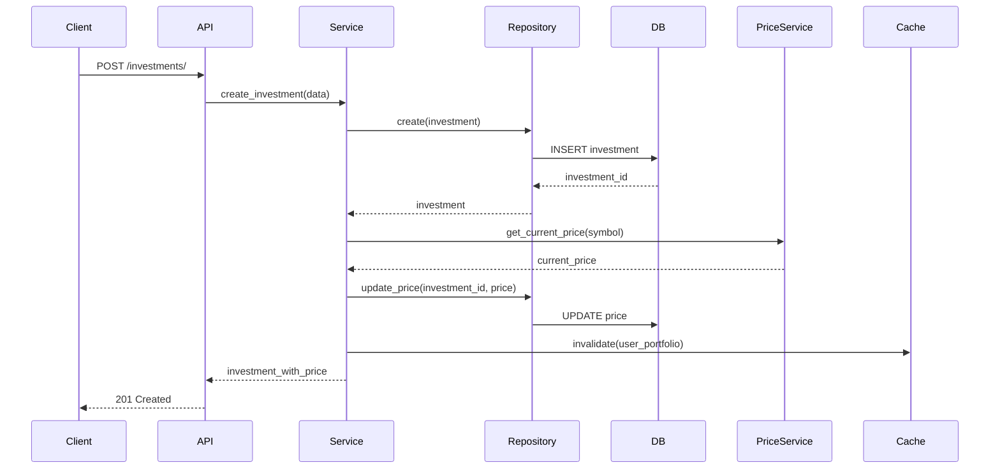
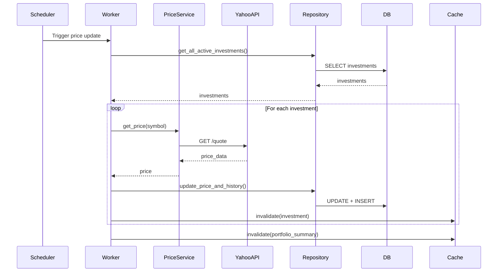
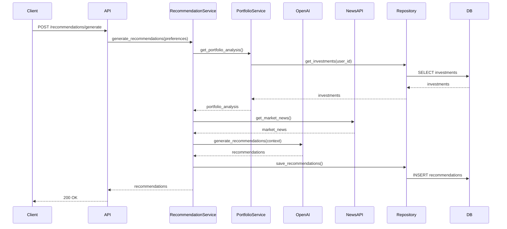

# Architecture - Investment Portfolio API

## Vue d'ensemble de l'architecture

L'Investment Portfolio API est conçue selon une architecture modulaire et scalable, suivant les principes de l'architecture hexagonale (Clean Architecture) pour assurer la séparation des préoccupations et la testabilité.

## Diagramme d'architecture globale



## Architecture en couches

### 1. Couche de présentation (API Layer)

**Responsabilités :**
- Exposition des endpoints REST
- Validation des données d'entrée
- Gestion de l'authentification et autorisation
- Formatage des réponses
- Gestion des erreurs

**Composants :**
```python
app/
├── api/
│   ├── v1/
│   │   ├── endpoints/
│   │   │   ├── investments.py      # CRUD des investissements
│   │   │   ├── portfolio.py        # Analyses de portfolio
│   │   │   ├── prices.py          # Gestion des prix
│   │   │   └── recommendations.py # Recommandations IA
│   │   └── api.py                 # Router principal
│   └── dependencies.py            # Dépendances communes
├── core/
│   ├── config.py                  # Configuration
│   ├── security.py                # Authentification JWT
│   └── database.py                # Connexion DB
└── main.py                        # Point d'entrée FastAPI
```

### 2. Couche de domaine (Domain Layer)

**Responsabilités :**
- Modèles métier
- Règles de gestion
- Interfaces (contrats)
- Entités du domaine

**Composants :**
```python
app/
├── models/
│   ├── investment.py              # Modèle Investment
│   ├── portfolio.py               # Modèle Portfolio
│   ├── price_history.py          # Modèle PriceHistory
│   └── user.py                    # Modèle User
├── schemas/
│   ├── investment.py              # Schémas Pydantic
│   ├── portfolio.py               # Schémas de portfolio
│   └── recommendation.py          # Schémas de recommandation
└── domain/
    ├── entities/
    │   ├── investment.py          # Entité Investment
    │   └── portfolio.py           # Entité Portfolio
    ├── value_objects/
    │   ├── money.py               # Value Object Money
    │   └── percentage.py          # Value Object Percentage
    └── interfaces/
        ├── repository.py          # Interface Repository
        └── price_service.py       # Interface PriceService
```

### 3. Couche d'application (Application Layer)

**Responsabilités :**
- Orchestration des cas d'usage
- Coordination entre les services
- Gestion des transactions
- Logique applicative

**Composants :**
```python
app/
├── services/
│   ├── investment_service.py      # Service des investissements
│   ├── portfolio_service.py       # Service du portfolio
│   ├── price_update_service.py    # Service de mise à jour des prix
│   ├── recommendation_service.py  # Service de recommandation
│   └── analytics_service.py       # Service d'analytique
├── use_cases/
│   ├── add_investment.py          # Cas d'usage: Ajouter investissement
│   ├── update_prices.py           # Cas d'usage: Mettre à jour prix
│   ├── generate_recommendations.py # Cas d'usage: Générer recommandations
│   └── analyze_portfolio.py       # Cas d'usage: Analyser portfolio
└── events/
    ├── investment_created.py      # Événement: Investissement créé
    ├── price_updated.py           # Événement: Prix mis à jour
    └── recommendation_generated.py # Événement: Recommandation générée
```

### 4. Couche d'infrastructure (Infrastructure Layer)

**Responsabilités :**
- Accès aux données
- Intégrations externes
- Configuration
- Monitoring

**Composants :**
```python
app/
├── repositories/
│   ├── investment_repository.py   # Repository Investment
│   ├── portfolio_repository.py    # Repository Portfolio
│   └── price_repository.py        # Repository Price
├── external_services/
│   ├── yahoo_finance_client.py    # Client Yahoo Finance
│   ├── openai_client.py           # Client OpenAI
│   └── news_client.py             # Client News APIs
├── database/
│   ├── base.py                    # Base de données
│   ├── session.py                 # Session DB
│   └── migrations/                # Migrations Alembic
├── cache/
│   ├── redis_client.py            # Client Redis
│   └── cache_service.py           # Service de cache
└── monitoring/
    ├── logging.py                 # Configuration logging
    ├── metrics.py                 # Métriques
    └── health_checks.py           # Health checks
```

## Patterns architecturaux utilisés

### 1. Repository Pattern

```python
# Interface du repository
class InvestmentRepository(ABC):
    @abstractmethod
    async def create(self, investment: Investment) -> Investment:
        pass
    
    @abstractmethod
    async def get_by_id(self, investment_id: UUID) -> Optional[Investment]:
        pass
    
    @abstractmethod
    async def get_by_user(self, user_id: UUID) -> List[Investment]:
        pass

# Implémentation PostgreSQL
class PostgreSQLInvestmentRepository(InvestmentRepository):
    def __init__(self, db: AsyncSession):
        self.db = db
    
    async def create(self, investment: Investment) -> Investment:
        # Implémentation avec SQLAlchemy
        pass
```

### 2. Service Layer Pattern

```python
class InvestmentService:
    def __init__(
        self,
        repository: InvestmentRepository,
        price_service: PriceService,
        cache_service: CacheService
    ):
        self.repository = repository
        self.price_service = price_service
        self.cache_service = cache_service
    
    async def create_investment(self, data: InvestmentCreate) -> Investment:
        # Validation métier
        # Création de l'investissement
        # Mise à jour du prix
        # Cache invalidation
        pass
```

### 3. Factory Pattern

```python
class PriceServiceFactory:
    @staticmethod
    def create_service(provider: str) -> PriceService:
        if provider == "yahoo_finance":
            return YahooFinancePriceService()
        elif provider == "alpha_vantage":
            return AlphaVantagePriceService()
        else:
            raise ValueError(f"Unsupported provider: {provider}")
```

### 4. Observer Pattern

```python
class InvestmentEventPublisher:
    def __init__(self):
        self.observers = []
    
    def subscribe(self, observer):
        self.observers.append(observer)
    
    def notify_investment_created(self, investment: Investment):
        for observer in self.observers:
            observer.on_investment_created(investment)

class PortfolioUpdateObserver:
    def on_investment_created(self, investment: Investment):
        # Mettre à jour les statistiques du portfolio
        pass
```

## Flux de données

### 1. Flux de création d'investissement



### 2. Flux de mise à jour des prix



### 3. Flux de génération de recommandations



## Gestion des erreurs et résilience

### 1. Circuit Breaker Pattern

```python
class CircuitBreaker:
    def __init__(self, failure_threshold: int = 5, timeout: int = 60):
        self.failure_threshold = failure_threshold
        self.timeout = timeout
        self.failure_count = 0
        self.last_failure_time = None
        self.state = "CLOSED"  # CLOSED, OPEN, HALF_OPEN
    
    async def call(self, func, *args, **kwargs):
        if self.state == "OPEN":
            if time.time() - self.last_failure_time > self.timeout:
                self.state = "HALF_OPEN"
            else:
                raise CircuitBreakerOpenException()
        
        try:
            result = await func(*args, **kwargs)
            if self.state == "HALF_OPEN":
                self.state = "CLOSED"
                self.failure_count = 0
            return result
        except Exception as e:
            self.failure_count += 1
            self.last_failure_time = time.time()
            
            if self.failure_count >= self.failure_threshold:
                self.state = "OPEN"
            
            raise e
```

### 2. Retry Pattern

```python
import asyncio
from typing import Callable, Any

class RetryHandler:
    def __init__(self, max_retries: int = 3, delay: float = 1.0):
        self.max_retries = max_retries
        self.delay = delay
    
    async def execute_with_retry(self, func: Callable, *args, **kwargs) -> Any:
        last_exception = None
        
        for attempt in range(self.max_retries + 1):
            try:
                return await func(*args, **kwargs)
            except Exception as e:
                last_exception = e
                if attempt < self.max_retries:
                    await asyncio.sleep(self.delay * (2 ** attempt))  # Exponential backoff
                else:
                    raise last_exception
```

### 3. Graceful Degradation

```python
class RecommendationService:
    def __init__(self, openai_client: OpenAIClient, fallback_service: BasicRecommendationService):
        self.openai_client = openai_client
        self.fallback_service = fallback_service
    
    async def generate_recommendations(self, user_preferences: UserPreferences):
        try:
            # Tentative avec l'IA avancée
            return await self.openai_client.generate_recommendations(user_preferences)
        except Exception as e:
            logger.warning(f"AI service failed: {e}, falling back to basic recommendations")
            # Fallback vers un service basique
            return await self.fallback_service.generate_basic_recommendations(user_preferences)
```

## Sécurité

### 1. Authentification et autorisation

```python
# JWT Token validation
class SecurityManager:
    def __init__(self, secret_key: str):
        self.secret_key = secret_key
    
    def create_access_token(self, user_id: UUID) -> str:
        payload = {
            "sub": str(user_id),
            "exp": datetime.utcnow() + timedelta(hours=24),
            "iat": datetime.utcnow()
        }
        return jwt.encode(payload, self.secret_key, algorithm="HS256")
    
    def verify_token(self, token: str) -> dict:
        try:
            payload = jwt.decode(token, self.secret_key, algorithms=["HS256"])
            return payload
        except jwt.ExpiredSignatureError:
            raise HTTPException(status_code=401, detail="Token expired")
        except jwt.JWTError:
            raise HTTPException(status_code=401, detail="Invalid token")
```

### 2. Validation des données

```python
# Pydantic schemas avec validation stricte
class InvestmentCreate(BaseModel):
    symbol: str = Field(..., min_length=1, max_length=20, regex=r'^[A-Z0-9.-]+$')
    name: str = Field(..., min_length=1, max_length=255)
    asset_type: AssetType = Field(...)
    country: str = Field(..., min_length=2, max_length=3, regex=r'^[A-Z]{2,3}$')
    purchase_date: date = Field(..., le=date.today())
    purchase_price: Decimal = Field(..., gt=0, decimal_places=4)
    quantity: Decimal = Field(..., gt=0, decimal_places=8)
    currency: str = Field(..., min_length=3, max_length=3, regex=r'^[A-Z]{3}$')
    
    @validator('purchase_date')
    def validate_purchase_date(cls, v):
        if v > date.today():
            raise ValueError('Purchase date cannot be in the future')
        return v
```

### 3. Rate Limiting

```python
from slowapi import Limiter
from slowapi.util import get_remote_address

limiter = Limiter(key_func=get_remote_address)

@app.post("/api/v1/recommendations/generate")
@limiter.limit("5/minute")  # 5 recommandations par minute
async def generate_recommendations(request: Request, ...):
    pass
```

## Performance et scalabilité

### 1. Caching Strategy

```python
class CacheStrategy:
    def __init__(self, redis_client: Redis):
        self.redis = redis_client
    
    async def get_portfolio_summary(self, user_id: UUID) -> Optional[dict]:
        cache_key = f"portfolio_summary:{user_id}"
        cached = await self.redis.get(cache_key)
        if cached:
            return json.loads(cached)
        return None
    
    async def set_portfolio_summary(self, user_id: UUID, data: dict, ttl: int = 300):
        cache_key = f"portfolio_summary:{user_id}"
        await self.redis.setex(cache_key, ttl, json.dumps(data))
    
    async def invalidate_portfolio_cache(self, user_id: UUID):
        pattern = f"portfolio_*:{user_id}"
        keys = await self.redis.keys(pattern)
        if keys:
            await self.redis.delete(*keys)
```

### 2. Database Optimization

```python
# Connection pooling
from sqlalchemy.pool import QueuePool

engine = create_async_engine(
    DATABASE_URL,
    poolclass=QueuePool,
    pool_size=20,
    max_overflow=30,
    pool_pre_ping=True,
    pool_recycle=3600
)

# Query optimization avec eager loading
async def get_user_portfolio_with_prices(user_id: UUID):
    query = select(Investment).options(
        selectinload(Investment.price_history)
    ).where(Investment.user_id == user_id)
    return await session.execute(query)
```

### 3. Background Task Processing

```python
from celery import Celery

celery_app = Celery('investment_portfolio')

@celery_app.task
async def update_all_prices():
    """Mise à jour asynchrone de tous les prix"""
    investments = await get_all_active_investments()
    
    for investment in investments:
        try:
            await update_investment_price.delay(investment.id)
        except Exception as e:
            logger.error(f"Failed to update price for {investment.symbol}: {e}")

@celery_app.task
async def update_investment_price(investment_id: UUID):
    """Mise à jour du prix d'un investissement spécifique"""
    # Logique de mise à jour
    pass
```

## Monitoring et observabilité

### 1. Logging structuré

```python
import structlog

logger = structlog.get_logger()

async def create_investment(investment_data: InvestmentCreate, user_id: UUID):
    logger.info(
        "Creating investment",
        user_id=str(user_id),
        symbol=investment_data.symbol,
        asset_type=investment_data.asset_type
    )
    
    try:
        investment = await investment_service.create(investment_data, user_id)
        logger.info(
            "Investment created successfully",
            investment_id=str(investment.id),
            user_id=str(user_id)
        )
        return investment
    except Exception as e:
        logger.error(
            "Failed to create investment",
            user_id=str(user_id),
            symbol=investment_data.symbol,
            error=str(e)
        )
        raise
```

### 2. Métriques

```python
from prometheus_client import Counter, Histogram, Gauge

# Métriques personnalisées
investment_created_total = Counter('investment_created_total', 'Total investments created')
price_update_duration = Histogram('price_update_duration_seconds', 'Price update duration')
active_investments = Gauge('active_investments_total', 'Total active investments')

@investment_created_total.inc()
@price_update_duration.time()
async def update_price(investment_id: UUID):
    # Logique de mise à jour
    pass
```

### 3. Health Checks

```python
@app.get("/health")
async def health_check():
    checks = {
        "database": await check_database_health(),
        "redis": await check_redis_health(),
        "yahoo_finance": await check_yahoo_finance_health(),
        "openai": await check_openai_health()
    }
    
    overall_status = "healthy" if all(checks.values()) else "unhealthy"
    
    return {
        "status": overall_status,
        "checks": checks,
        "timestamp": datetime.utcnow().isoformat()
    }
```

Cette architecture garantit la scalabilité, la maintenabilité et la robustesse de l'application Investment Portfolio API tout en respectant les meilleures pratiques de développement.
